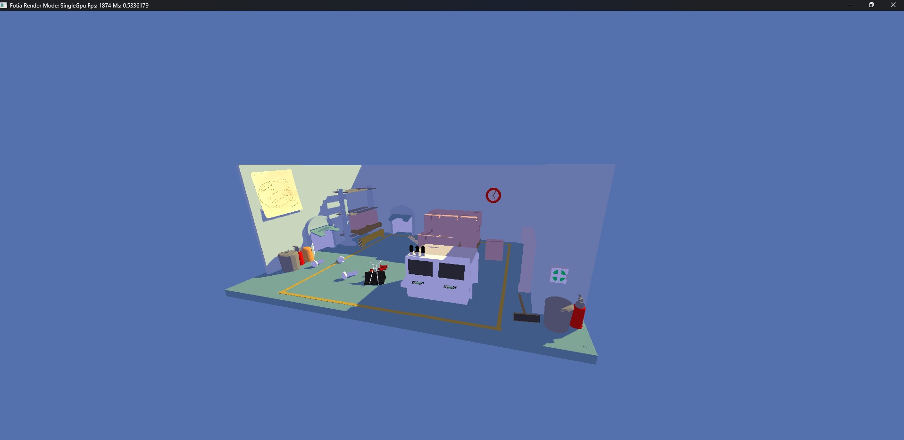
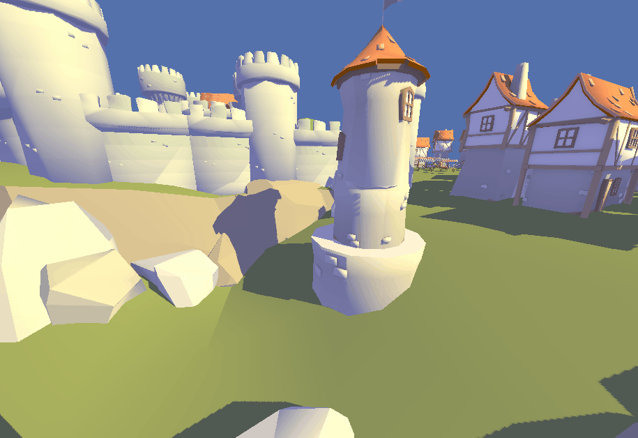

# Fotia

An experimental Multi-GPU renderer for master's thesis.

The first prototype can be found here [Multi-Gpu Shadows](https://github.com/if0ne/multi-gpu-shadows)

# How to start

1. Clone repo
2. Download any GLTF scene, such as https://skfb.ly/6C7pD
3. `cargo build --release`
4. Put the scene in the assets folder next to the generated executable file
5. Configure the path to the scene in config.toml, which lies next to the executable file (all settings [here](https://github.com/if0ne/fotia/blob/64309e8a4ef97a2ae800ccc7b41e4519d42487bd/src/settings.rs#L50))

# Controls

- **W / A / S / D** — movement
- **Mouse** — rotate camera
- **1** — enable *Single GPU Shadows Rendering* mode
- **2** — enable *Multi-GPU Shadows Rendering* mode

# References

Inspired by:

1. [Halcyon by SEED](https://www.wihlidal.com/projects/seed-halcyon-1/)
2. [o3de](https://github.com/o3de/sig-graphics-audio/discussions/32)
3. [blade by kvark](https://github.com/kvark/blade)

# Demo

# Glitch

Due to the asynchronous nature of the algorithm and large performance differences between GPUs, there may be artifacts when the camera rotates quickly.

